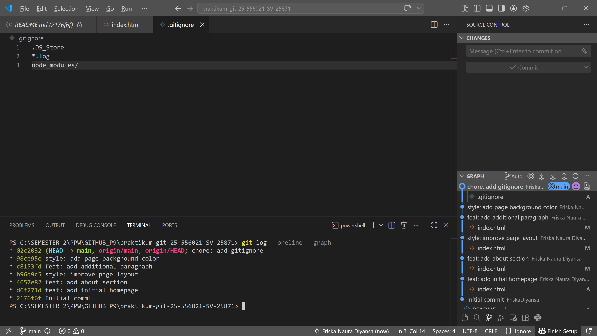
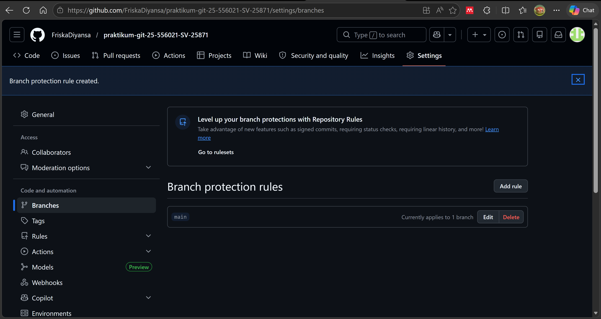

# praktikum-git-25-556021-SV-25871

## Screenshot Git Log

## Branch Protection Rule

## Deskripsi Project
Project ini merupakan latihan penggunaan Git dan GitHub, meliputi commit, branching, pull request, conflict resolution, dan release.

## Cara Menjalankan
1. Clone repository:
   git clone <link-repo>
2. Buka file index.html di browser

## Git Command yang Digunakan

- git init: untuk inisialisasi repo
- git clone:untuk mengambil repo dari GitHub
- git add .: menambahkan perubahan
- git commit -m "pesan": menyimpan perubahan
- git push: mengirim ke GitHub
- git branch: membuat branch
- git checkout: pindah branch
- git merge: menggabungkan branch
- git rebase: merapikan commit